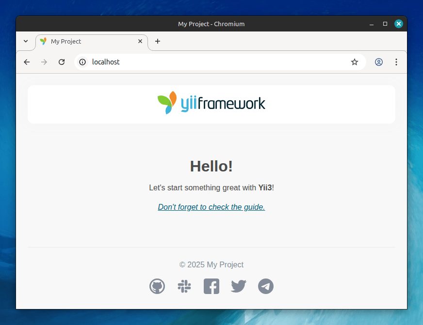

<p align="center">
    <a href="https://github.com/yiisoft" target="_blank">
        
    </a>
    <h1 align="center">Yii3 web application</h1>
    <h3 align="center">An application template for a new web project</h3>
    <br>
</p>

[](https://packagist.org/packages/yiisoft/app)
[](https://packagist.org/packages/yiisoft/app)
[](https://github.com/yiisoft/app/actions/workflows/build.yml)
[](https://codecov.io/gh/yiisoft/app)
[](https://github.com/yiisoft/app/actions?query=workflow%3A%22static+analysis%22)
[](https://shepherd.dev/github/yiisoft/app)

<p>
    <a href="https://github.com/yiisoft/app" target="_blank">
        
    </a>
</p>

The package is a classic web application template. If you need console only or API please start with corresponding
templates:

- [Console application template](https://github.com/yiisoft/app-console)
- [API application template](https://github.com/yiisoft/app-api)

## Requirements

- PHP 8.2 or higher.

## Installation

### Local installation

If you do not have [Composer](https://getcomposer.org/), you may install it by following the instructions
at [getcomposer.org](https://getcomposer.org/doc/00-intro.md).

Create a project:

```shell
composer create-project yiisoft/app myproject
cd myproject
```

Configure the environment by creating a `.env` file from the example:

```shell
cp .env.example .env
```

The `.env` file allows you to configure the application environment and other settings:
- `APP_ENV`: Application environment (`dev`, `test`, or `prod`)
- `APP_DEBUG`: Enable debug mode (`true` or `false`)

> **Note:** The `.env` file is excluded from version control. When deployed to production without a `.env` file,
> the application will default to the `prod` environment.

To run the app:

```shell
./yii serve
```

Or with explicit environment override:

```shell
APP_ENV=dev ./yii serve
```

Now you should be able to access the application through the URL printed to console.
Usually it is `http://localhost:8080`.

### Installation with Docker

> [!WARNING]
> Docker compose version 2.24 or above is required.

Fork the repository, clone it, then:

```shell
cd myproject
cp .env.docker.example .env.docker
make composer update
```

Docker uses environment-specific configuration files from the root directory:
- `.env.docker` - Docker-specific variables (stack name, ports, image names, etc.)
- `.env.dev.example` - Development environment (used by default)
- `.env.prod.example` - Production environment
- `.env.test.example` - Test environment

You can customize settings by creating override files (e.g., `.env.dev`) which are automatically loaded if present.

To run the app:

```shell
make up
```

To stop the app:

```shell
make down
```

The application is available at `https://localhost`.

Other make commands are available in the `Makefile` and can be listed with:

```shell
make help
```

## Directory structure

The application template has the following structure:

```
.dockerignore           Docker ignore file
.env.example            Example environment configuration for local development
.env.docker.example     Docker-specific variables (stack name, ports, image names, etc.)
.env.dev.example        Docker development environment configuration
.env.prod.example       Docker production environment configuration
.env.test.example       Docker test environment configuration
.env.override.example   Example override file for custom local settings
Dockerfile              Docker image definition
compose.yml             Base Docker Compose configuration
compose.dev.yml         Docker Compose configuration for development
compose.prod.yml        Docker Compose configuration for production
compose.test.yml        Docker Compose configuration for testing
assets/                 Asset bundle source files.
config/                 Configuration files.
    common/             Common configuration and DI definitions.
    console/            Console-specific configuration.
    environments/       Environment-specific configuration (dev/test/prod).
    web/                Web-specific configuration.
public/                 Files publically accessible from the Internet.
    assets/             Published/compiled assets.
    index.php           Entry script.
runtime/                Files generated during runtime.
src/                    Application source code.
    Console/            Console commands.
    Shared/             Code shared between web and console applications.
    Web/                Web-specific code (actions, handlers, layout).
        Shared/         Shared web components.
            Layout/     Layout components and templates.
    DotEnvLoader.php    Simple .env file loader for non-Docker environments.
    Environment.php     Environment configuration class.
tests/                  A set of Codeception tests for the application.
    Console/            Console command tests.
    Functional/         Functional tests.
    Unit/               Unit tests.
    Web/                Web actions tests.
vendor/                 Installed Composer packages.
Makefile                Config for make command.
yii                     Console application entry point.
```

## Testing

The template comes with ready to use [Codeception](https://codeception.com/) configuration.
To execute tests, in local installation run:

```shell
./vendor/bin/codecept build

APP_ENV=test ./yii serve > ./runtime/yii.log 2>&1 &
./vendor/bin/codecept run
```

For Docker:

```shell
make codecept build
make codecept run
```

## Static analysis

The code is statically analyzed with [Psalm](https://psalm.dev/). To run static analysis:

```shell
./vendor/bin/psalm
```

or, using Docker:

```shell
make psalm
```

## Support

If you need help or have a question, check out [Yii Community Resources](https://www.yiiframework.com/community).

## License

The Yii3 web application template is free software. It is released under the terms of the BSD License.
Please see [`LICENSE`](./LICENSE.md) for more information.

Maintained by [Yii Software](https://www.yiiframework.com/).

## Support the project

[](https://opencollective.com/yiisoft)

## Follow updates

[](https://www.yiiframework.com/)
[](https://twitter.com/yiiframework)
[](https://t.me/yii3en)
[](https://www.facebook.com/groups/yiitalk)
[](https://yiiframework.com/go/slack)
