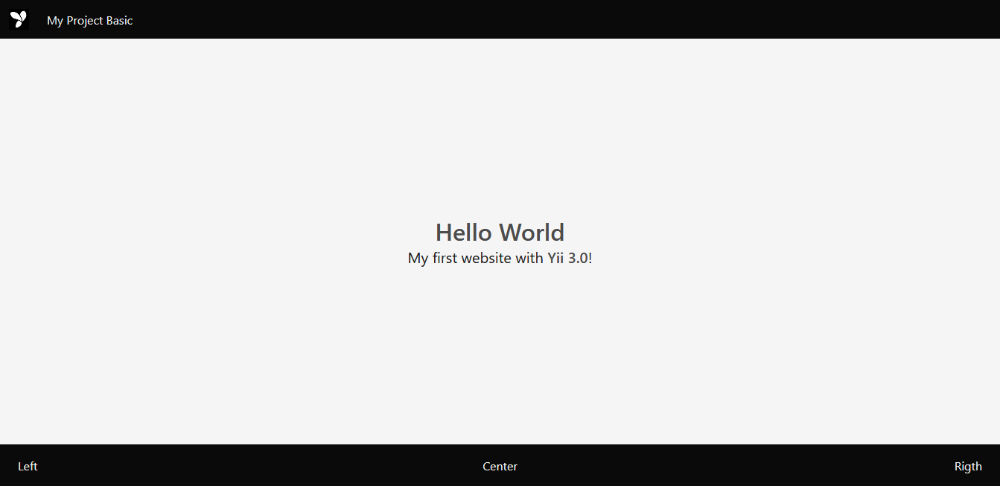

<p align="center">
    <a href="https://github.com/yiisoft" target="_blank">
        
    </a>
    <h1 align="center">Yii application template</h1>
    <br>
</p>

[](https://packagist.org/packages/yiisoft/app)
[](https://packagist.org/packages/yiisoft/app)
[](https://github.com/yiisoft/app/actions)
[](https://scrutinizer-ci.com/g/yiisoft/app/?branch=master)
[](https://scrutinizer-ci.com/g/yiisoft/app/?branch=master)

<p align="center">
    <a href="https://github.com/yiisoft/app" target="_blank">
        
    </a>
</p>

Yii application template for Yii 3 is best for rapidly creating projects.

### Directory structure

      config/             contains application configurations
      resources/layout    contains layout files for the web application
      resources/view      contains view files for the web application
      app/                application directory
          Asset/          contains assets definition
          Controller/     contains Web controller classes
          Factory/        contains factory classes files for config
          Provider/       contains provider classes for config
      runtime/            contains files generated during runtime
      tests/              contains various tests for the basic application
      vendor/             contains dependent 3rd-party packages      
      public/             contains the entry script and Web resources

### Requirements

The minimum requirement by this project template that your Web server supports PHP 7.4.0.

### Installation

If you do not have [Composer](http://getcomposer.org/), you may install it by following the instructions
at [getcomposer.org](http://getcomposer.org/doc/00-intro.md#installation-nix).

You can then install this project template using the following command:

~~~
composer create-project --prefer-dist --stability dev yiisoft/app <your project>
~~~

Now you should be able to access the application through the following URL, assuming `app` is the directory
directly under the `public` root.

### Web application config

`config/params.php:`

```php
<?php

declare(strict_types=1);

use Psr\Log\LogLevel;

return [
    'aliases' => [
        '@root' => dirname(__DIR__),
        '@assets' => '@root/public/assets',
        '@assetsUrl' => '/assets',
        '@npm' => '@root/node_modules',
        '@public' => '@root/public',
        '@resources' => '@root/resources',
        '@runtime' => '@root/runtime',
        '@views' => '@root/resources/views'
    ],

    'app' => [
        'brandurl' => '/',
        'charset' => 'UTF-8',
        'hero.options' => ['class' => 'hero is-fullheight is-light'],
        'hero.head.options' => ['class' => 'hero-head has-background-black'],
        'hero.body.options' => ['class' => 'hero-body is-light'],
        'hero.container.options' => ['class' => 'container has-text-centered'],
        'hero.footer.options' => ['class' => 'hero-footer has-background-black'],
        'hero.footer.column.options' => ['class' => 'columns is-mobile'],
        'hero.footer.column.left' => 'Left',
        'hero.footer.column.left.options' => ['class' => 'column has-text-left has-text-light'],
        'hero.footer.column.center' => 'Center',
        'hero.footer.column.center.options' => ['class' => 'column has-text-centered has-text-light'],
        'hero.footer.column.right' => 'Right',
        'hero.footer.column.right.options' => ['class' => 'column has-text-right has-text-light'],
        'language' => 'en',
        'logo' => '/images/yii-logo.jpg',
        'name' => 'My Project',
        'navbar.options' => ['class' => 'navbar'],
        'navbar.brand.options' => ['class' => 'navbar-brand'],
        'navbar.brand.logo.options' => ['class' => 'navbar-item'],
        'navbar.brand.title.options' => ['class' => 'navbar-item has-text-light'],
        'filerotator' => [
            'maxfilesize' => 10,
            'maxfiles' => 5,
            'filemode' => null,
            'rotatebycopy' => null
        ],
        'logger' => [
            'file' => '@runtime/logs/app.log',
            'levels' => [
                LogLevel::EMERGENCY,
                LogLevel::ERROR,
                LogLevel::WARNING,
                LogLevel::INFO,
                LogLevel::DEBUG,
            ]
        ],
        'session' => [
            'options' => ['cookie_secure' => 0],
            'handler' => null
        ],
    ],

    'yiisoft/yii-debug' => [
        'enabled' => true
    ],
];
```

### Using PHP built-in server

~~~
php -S 127.0.0.1:8080 -t public
~~~

### Wait till it is up, then open the following URL in your browser

~~~
http://localhost:8080
~~~

### Running Codeception tests

~~~
php -S 127.0.0.1:8080 -t public > yii.log 2>&1 &
vendor/bin/codecept run
~~~
